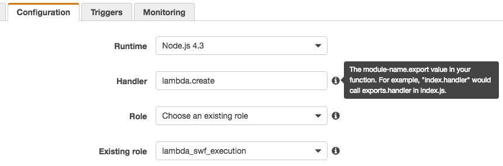
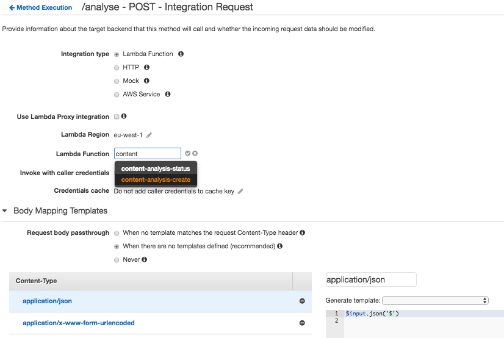

# swf-hook

> A Node.js library to **kickstart and track progress** of an Amazon SWF execution as a web service.

If you want to **setup an HTTP endpoint** to allow your users to **start executions from a payload** and to let them track its progress, _this_ is the library you need.

`swf-hook` can consume **JSON** and **form encoded** payloads.
It has been primarily designed to be deployed as a *Node.js 4.3 [AWS Lambda][aws-lambda]* behind [API Gateway][aws-ag] without having to write boilerplate code.

```bash
curl \
  -d 'url=http://example.com' \
  -d 'another_payload=value' \
   https://${API_ID}.execute-api.eu-west-1.amazonaws.com/test/analyse?api_key=$API_KEY
```

# Install

```bash
npm i --save swf-hook
```

# Node.js Usage

```js
const hook = require('swf-hook');
const AWS = require('aws-sdk');
const swf = new AWS.SWF({ region: process.env.DEFAULT_AWS_REGION });

const { create, activities } = hook(swf, swfOptions);
```

## Configuration

The main function `hook` accepts two arguments:

1. An [SWF client][aws-swf-client] object;
2. An optional object of `swfOptions` to be applied to all SWF API calls.

## `#create(input[, swfOptions])`

Creates a new workflow execution with a given `input`.

Required `swfOptions`:

- `domain`
- `workflowType`

```js
create(input, swfOptions).then(result => {
  const { runId, workflowId } = execution;

  console.log({ runId, workflowId });
});
```

## `#activities(execution[, swfOptions])`

Aggregates the status of each known activity of a given workflow execution.

Required `swfOptions`:

- `domain`

```js
activities({ runId, workflowId }, swfOptions).then(summary => {
  console.log(summary);
});
```

The `summary objects` looks like the following output:

```json
{
  "status": "Started",
  "execution": {
    "workflowId": "5c42f06b-7cc5-4bd5-8813-4620fb5ad240",
    "runId": "22qIzqlMXRNFjGK9AODY+89HfVJjCC6OIheIVk/l/PfN4=",
    "startedAt": "2016-11-22T17:41:13.729Z",
    "completedAt": "",
    "stdin": "15546879:http://economictimes.indiatimes.com/articleshow/55568199.cms"
  },
  "activities": [
    {
      "activityType": {
        "name": "RenderHtml",
        "version": "20150917"
      },
      "status": "Completed",
      "scheduledAt": "2016-11-22T17:41:14.508Z",
      "startedAt": "2016-11-22T17:41:22.353Z",
      "completedAt": "2016-11-22T17:41:28.293Z",
      "identity": "f7f03c7cd43c:1",
      "activityId": "720f62ee-d351-4625-ad99-4773e8b9f728",
      "stdout": "{\"properties\":[\"http://schema.org/url\",\"http://prototyping.bbc.co.uk/ns#html\"]}"
    },
    {
      "activityType": {
        "name": "ExtractBody",
        "version": "20141218"
      },
      "status": "Completed",
      "scheduledAt": "2016-11-22T17:41:28.808Z",
      "startedAt": "2016-11-22T17:41:28.868Z",
      "completedAt": "2016-11-22T17:41:29.478Z",
      "identity": "f29d4a21f76b:1",
      "activityId": "bed39299-7314-406f-b6cd-d64d8b175a9d",
      "stdout": "{\"properties\":[\"http://schema.org/articleBody\",\"http://schema.org/text\"]}"
    },
    {
      "activityType": {
        "name": "Summariser",
        "version": "20160218"
      },
      "status": "Scheduled",
      "scheduledAt": "2016-11-22T17:41:29.925Z",
      "startedAt": "",
      "completedAt": "",
      "identity": "",
      "activityId": "4eb818a1-3c8c-408c-951c-22e83b069685"
    }
  ]
}
```


# Amazon Lambda Usage

The following snippet of code will expose two handlers — `create` and `activities` — to your AWS Lambda:

```js
const hook = require('aws-hook/lambda');

exports = hook;
```

You then have to specify which _handler_ and which _function_ to execute when the lambda is invoked.



## Configuration

Configuration exclusively happens via _environment variables_.

It is recommended you assign an _AMI role_ which allows to `swf:StartWorkflowExecution` and `swf:GetWorkflowExecutionHistory` actions.
Have a look at [`iam-policy.json`](iam-policy.json) for more details.

You can hook the lambda to AWS Gateway API routes to trigger the code via HTTP as long as you map the _Body Mapping Template_ accordingly.
Have a look at [`openapi.yaml`](openapi.yaml) for more details about a possible gateway route definition.

## Environment Variables

Environment variables are translated into `swfOptions`, as is or from prefixed _MACRO_CASE_.

Eg: `SWF_DOMAIN=Foo` and `SWF_WORKFLOW_TYPE='name=Bar,version=201611'` will be translated into the following `swfOptions` object:

```js
{
  domain: "Foo",
  workflowType: {
    name: "Bar",
    version: "201611"
  }
}
```

Because of [Lambda rules for naming environment variables][aws-lambda-rules] and their inconsistency to match the CLI shorthand notation, the _MACRO_CASE_ is expanded on a single level each time it encounters a `__` in the variable key.

Eg: `SWF_WORKFLOW_TYPE__NAME=Bar` and `SWF_WORKFLOW_TYPE__VERSION=201611'` will be translated into the following `swfOptions` object:

```js
{
  workflowType: {
    name: "Bar",
    version: "201611"
  }
}
```

## `<handler>.create`

The content of the lambda `event` argument will be passed to the `create` function.



## `<handler>.activities`

The content of the lambda `event` argument will be passed to the `activities` function.

It is mandatory to pass an object which contains the `workflowId` and `runId` keys — given out as the response of the `create` method.

# License

    Licensed to the Apache Software Foundation (ASF) under one
    or more contributor license agreements.  See the NOTICE file
    distributed with this work for additional information
    regarding copyright ownership.  The ASF licenses this file
    to you under the Apache License, Version 2.0 (the
    "License"); you may not use this file except in compliance
    with the License.  You may obtain a copy of the License at

      http://www.apache.org/licenses/LICENSE-2.0

    Unless required by applicable law or agreed to in writing,
    software distributed under the License is distributed on an
    "AS IS" BASIS, WITHOUT WARRANTIES OR CONDITIONS OF ANY
    KIND, either express or implied.  See the License for the
    specific language governing permissions and limitations
    under the License.

[aws-lambda]: https://aws.amazon.com/lambda/details/
[aws-lambda-rules]: https://docs.aws.amazon.com/lambda/latest/dg/env_variables.html#env_limits
[aws-ag]: https://aws.amazon.com/api-gateway/details/
[aws-swf-client]: https://docs.aws.amazon.com/AWSJavaScriptSDK/latest/AWS/SWF.html
